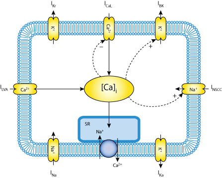

Original Paper
==============

:Original publication:  "A Quantitative Model of Gastric Smooth Muscle Cellular Activation"

:DOI: 10.1007/s10439-007-9324-8

Model status
=============
The original CellML model is divided into eight sub-modules presenting a modularized version of various ion channels.

Model Summary
==============
A physiologically realistic quantitative description
of the electrical behavior of a gastric smooth muscle (SM) cell
is presented. The model describes the response of a SM cell
when activated by an electrical stimulus coming from the
network of interstitial cells of Cajal (ICC) and is mediated by
the activation of different ion channels species in the plasma
membrane.

The model is implemented using a Hodgkin-Huxley type formulation. The cell membrane lipid bilayer is represented as a capacitance (Cm),
and the ion channels in the membrane are represented as conductance. The change in the transmembrane potential (Vm) over time depends on
is the sum of the individual ion currents through each class of ion channel in the cell current:

:math:` \frac{dVm}{dt} = - \frac{I_{tot}}{C_{m}}`.

Where there are 8 different ion channels as below:

A-Type voltage gated potassium channels: Ika,

Background potassium channels: Ib,

Ca2+/Na+ exchangers: ICaSR,

L-Type Ca2+ voltage-gated channels (long lasting): ICa-L,

T-Type Ca2+ voltage-gated channel (low voltage activated channel-LVA): ICa-T,

Delayed-Rectifying potassium channels: Ikr,

Non-selective cation channels: INSCC

Sodium channels: INKCC.

In each folder, there are two CellML files: one related to the experiment and the other one the main CellML code for the selected ion channel.
